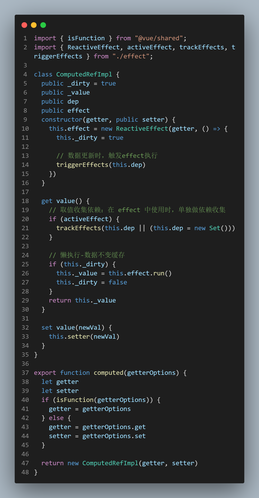

# Vue3 Handwriting

## Init 初始化

包管理工具为 `pnpm workspace`, 用以实现  `monorepo` (pnpm是快速、节省磁盘空间的包管理器。主要采用符号链接的方式管理模块)

```cmd
全局安装 pnpm
npm install pnpm -g

初始化项目
pnpm init -y
```

## Add Dependencies

```cmd
pnpm install typescript rollup rollup-plugin-typescript2 @rollup/plugin-json @rollup/plugin-node-resolve @rollup/plugin-commonjs minimist execa@4 esbuild   -D -w

```

1. 基于 typescript 开发，配置 tsconfig 文件
```js
pnpm tsc --init

// 生成如下代码 tsconfig.json
{
  "compilerOptions": {
    "outDir": "dist",
    "sourceMap": true,
    "target": "ES2016",
    "newLine": "lf",
    "useDefineForClassFields": false,
    "module": "ESNext",
    "moduleResolution": "node",
    "allowJs": false,
    "strict": false,
    "resolveJsonModule": true,
    "esModuleInterop": true,
    "jsx": "preserve",
    "lib": [
      "ESNext",
      "DOM"
    ],
    // 配置当前项目引入路径别名(reactivity引入shared方法，可直接 import from "@vue/shared")
    "baseUrl": ".",
    "paths": {
      "@vue/*": [
        "package/*/src"
      ]
    }
  }
}
```

## Structure 工作目录

- packages
  - reactivity 
    - src
    - package.json （`pnpm init `生成）
  - shared
    - src
- sc

## Reactive Package

### 数据代理
`vue3` 是基于 `Proxy` 实现，而 `vue2` 是基于 `Object.defineProperty``。注意，Proxy` 搭配 `Reflect` 实现，用以解决 `this` 调用时指向问题。

```js
cconst school = {
  students: 100,
  teachers: 200,
  get total() {
    return this.students + this.teachers
  }
}

const p = new Proxy(school, {
  get(target, key, receiver) {
    console.log(`Get ${key} ----`)
    // return target[key]

    // 绑定 school.total 取值(this.students + this.teachers)时内部的 this 会绑定为代理后的 p 对象 
    return Reflect.get(target, key, receiver)
  },
  set(target, key, value, receiver) {
    console.log(`Set ${key} ----`)
    return target[key] = value
  }
})

console.log(p.total)

/**
 * Proxy 不用 Reflect 时，则只会触发 total 在代理取值时的操作，this指向的是 school
 * Get total ----
 * 300
 * 
 * 使用 Reflect 时，this 则指向代理对象 p
 * Get total ----
 * Get students ----
 * Get teachers ----
 * 300
 */
```

### 特殊数据代理处理

分三种情况：非对象，重复代理，被代理过的对象

```js
  // target 值不同，处理方式如下：
  // 1. 非对象不代理
  if (!isObject(target)) return target

  // 2. 重复代理
  let existingProxy = reactiveMap.get(target)
  if (existingProxy) {
    return existingProxy
  }

  // 3. 代理后对象
  // 只有被代理的对象
  if (target[ReactiveFlags.IS_REACTIVE]) {
    return target
  }
```

### effect 函数执行

1. 如何关联正在执行的 effect 和响应式数据的取值
  - `effect.ts` 暴露出变量 `activeEffect`
  - `get` 取值操作时，通过变量 `activeEffect` 就建立起连接 `{target -> key -> dep}`
  - **每执行完一个 effect(fn)，就要清空当前的 activeEffect；而执行前，把 reactiveEffect 实例复制给 activeEffect**，这样才能保证fn执行时，内部用到的响应式数据，可以建立连接
  

2. 每调用一次 effect，就会重新 new 一个 `ReactiveEffect`
  - 嵌套 effect 需要考虑在内。
  
  - 解决方案 2.x 基于栈来处理（进出栈），需要额外维护。
  - vue3 则运用树结构，标记关系即可。
  

### 依赖收集
默认执行 effect 时会对属性，进行依赖收集

- effect 函数内取值，才会 
- `activeEffect.deps` 将属性和对应的 `effect` 维护成映射关系，后续属性变化可以触发对应的 `effect` 函数重新 `run`


### 触发更新
取值时已收集过依赖，更新操作即触发 effect 重新执行


### 清除 effect 产生的副作用

flag 动态收集依赖（如下），就需要清除依赖
```js
import { reactive, effect } from './index.js'
    
const state = reactive({ flag: true, name: 'Stella', age: 18, address: 'Wuhan' })
effect(() => {
  console.log('effect exec')

  // 1. flag 为true，取值逻辑只有 name 没有 age，effect 只与 name 建立 connection
  app.innerHTML =  state.flag
    ? 'Name: ' + state.name
    : 'Age: ' + state.age
})

setTimeout(() => {
  // 此处 flag 设置为 false，触发 effect，取值只会取 age，前面 name 取值收集的依赖应该清除
  state.flag = false
  
  setTimeout(() => {
    // 修改 name，不应触发 effect 函数执行
    state.name ='Yang'
  }, 1000)
}, 1000)

```

更新操作时，会触发收集的 effect 执行，执行前应将此前收集的（取消绑定的）effect 清除掉
```js
class ReactiveEffect {
  private parent
  active = true
  // 记录 effect 中使用的属性
  deps = []
  constructor(private fn) { }

  run() {
    try {
      this.parent = activeEffect
      activeEffect = this
      // 清理收集的 effect +
      cleanupEffect(this)
      this.fn()
    } finally {
      activeEffect = this.parent
      this.parent = undefined
    }
  }

  stop() { }
}

function cleanupEffect(effect) {
  const { deps } = effect

  for (let i = 0; i < deps.length; i++) {
    deps[i].delete(effect)
  }
  effect.deps.length = 0
}

export function trigger(target, type, key, value, oldValue) {
  const depsMap = targetMap.get(target)
  if (!depsMap) {
    return
  }

  const deps = depsMap.get(key) || new Set()
  /** +++++++
   * 直接操作 effects 会导致死循环
   * 解决：应改为副本，再迭代操作
   * 
   * { name: Set[e1, e2] }
   * { age: Set[e2, e3] }
   */

  const effects = [...deps]
  effects && effects.forEach(effect => {
    if (effect !== activeEffect) {
      effect.run()
    }
  });

}
```

### Stop Effect
默认响应式数据，是自动更新的。而某些场景，是需要用户手动更新 effect，即 forceUpdate

1. `effect` 调用后，会返回一个对象 `runner` ，挂在了 `effect` 实例对象
2. `runner` 就是 `run` 方法
3. 调用 `stop` 后，再次修改 `state` 不会触发更新
4. 停止 effect 之后，需要清理收集的依赖，并将 ReactiveEffet.active 变为失活状态
5. 调用 runner 方法，判断 active 是否失活，不走依赖收集，直接调用 fn

用法
```js
    const state = reactive({  name: 'Stella' })
    
    const runner = effect(() => {
      app.innerHTML = state.name
    })

    runner()
    
    // 清理依赖
    runner.effect.stop()

    // 失活后，任然可以调用，手动更新
    state.name = 'yang'
    runner() 

```

### 调度执行 scheduler
`effect` 方法，内部传入 `scheduler` 方法，可以在数据变化时，自行操作 `run`
`trigger` 触发时，我们可以自己决定副作用函数执行的时机、次数、及执行方式

```js
// effect.ts function trigger() {}
 effects && effects.forEach(effect => {
    // 防止再次执行的 effect
    if (effect !== activeEffect) {
      // 执行用户传入 scheduler
      if (effect.scheduler) {
        effect.scheduler()
      } else {
        effect.run()
      }
    }
  });
```

### 深度代理

state 属性对应的对象，也需要深度代理
```js
// baseHandlers.ts function mutableHandlers() {}
  get(target, key, receiver) {
    if (key === ReactiveFlags.IS_REACTIVE) {
      return true
    }

    // 深度代理
    const res = Reflect.get(target, key, receiver)
    if (isObject(res)) {
      return reactive(res)
    }

    // 取值关联 target, key 和 effect
    track(target, 'get', key)

    return res
  },
```

## watch Method

### watch
`Vue` 框架，分包管理。`watch` 的大致关系为 `vue` -> `runtime-dom` -> `reactivity`

watch 内部就是 new 一个 `ReactiveEffect`，传入 fn 和 `scheduler`，fn 包装成 getter，触发取值操作，数据变化时，自行执行 `scheduler`

### watchEffect
watchEffect 本质就是一个 effect，默认是异步执行；
watch 是监控一个数据的变化，数据更新执行 effect

```js
// effect + scheduler 取值操作，收集依赖，并将前后取值返回
export function watch(source, cb, options) {
  doWatch(source, cb, options)
}

// watchEffect 本质是一个 effect
export function watchEffect(source, options) {
  doWatch(source, null, options)
}

/** 
* 不同点：
* 1. 参数一：watch 两种传参方式（对象 or 函数返回值取值），即 getter
* 2. 参数二：watch 数据更新的回调函数。watchEffect 是 options，没有

* 相同点：
* 1. 默认都是异步执行操作
* 2. 参数三，可传入 flush 参数，取消异步执行时机
*/
export function doWatch(source, cb, options) {
  // 1. source 是响应式对象
  // 2. source 是一个函数
  // 3. ReactiveEffect fn 为取值操作，() => 自动触发操作

  let getter;
  if (isReactive(source)) {
    getter = traverse(source)
  } else if (isFunction(source)) {
    // watchEffect 传入的就是包含取值操作的函数，new ReactiveEffect 时取值收集依赖
    getter = source
  }

  let oldValue

  const scheduler = () => {
    if (cb) {
      // watch 函数，第二个参数
      const newValue = effect.run()
      cb(newValue, oldValue)
      oldValue = newValue
    } else {
      // watchEffect 则是直接帮忙执行 source 方法，等同于 effect 方法
      effect.run()
    }
  }

  // watch 和 watchEffect 复用 new ReactiveEffect，传入 scheduler
  // scheduler 根据是否传入 cb，
  const effect = new ReactiveEffect(getter, scheduler)

  // 先触发取值，收集依赖，保存 getter 返回的值
  oldValue = effect.run()
}
```

### watch cleanup


背景
**场景**：用户输入框中，输入信息查询，后端数据返回时间问题，会导致返回数据渲染问题。
**方案**：
  1. 取消请求
  2. 清理定时器
  3. 屏蔽数据（类似防抖操作，最新请求发出时，丢弃上次请求返回值）
**代码解决**
  1. `vue2` 中需要自行解决
  2. `vue3` 提供 `onCleanup` 回调函数
  ```js
  // mock backend response
    let time = 3000
    function getData(input) {
      return new Promise(resolve => {
        setTimeout(() => resolve(input), time -= 1000)
      })
    }

    const state = reactive({ name: 'Stella', age: 18 })

    let arr = []
    watch(() => state.age, async function callback (newVal, oldVal, onCleanup) {
      // 屏蔽返回的数据，不进行更新

      // vue2 处理方式
      // 闭包：函数的创建和执行不在一个作用域。
      // debugger 
      // 通过代码调试：
      // 每次更新age值，都会触发 callback 执行，getData 返回的数据需要等待时间
      // 类似防抖操作，下一次请求操作发出时，丢弃上次的返回值

      while(arr.length > 0) {
        let fn = arr.shift()
        fn()
      }

      let flag = true
      arr.push(() => flag = false )
      // vue3 提供 onCleanup
      // let flag = true
      // onCleanup(() => flag = false)

      const res = await getData(newVal)
      flag && (app.innerHTML = res)
    })

    // 不用 setTimeout 默认批量更新
    const timer1 = setTimeout(() => state.age = 19) // 3s后返回
    const timer2 = setTimeout(() => state.age = 20) // 2s后返回
    const timer3 = setTimeout(() => state.age = 21) // 1s后返回 newVal
  ```

vue3 实现
```js
// apiWatch.ts

let cleanup;
const onCleanup = fn => {
  cleanup = fn
}
const scheduler = () => {
  if (cleanup) cleanup()

  if (cb) {
    const newValue = effect.run()
    cb(newValue, oldValue, onCleanup)
    oldValue = newValue
  } else {
    effect.run()
  }
}
```

## computed

### 计算属性特点
1. 主要是根据其他数据进行衍生数据
2. 懒执行，若依赖的值不发生变化，不会重新执行，dirty 缓存
  ```js
    const state = reactive({ firstname: 'Stella', lastname: 'Yang' })

    const fullname = computed({
      get() {
        // 读取多次，get 取值器只会触发一次，数据dirty，再次读取再次触发
        console.log('get fullname')
        return state.firstname + ' ' +  state.lastname
      }, 
      set() {

      }
    })

    
    app.innerHTML = fullname.value
    fullname.value
    fullname.value
    fullname.value
  

    state.firstname = 'Fan'
  ```
3. 自身无法修改
4. 依赖的数据变化，后续再取值会获取新值，不是 effect 不会触发更新，再次取值获取新值
5. 返回 `ComputedRefImpl`，自行收集依赖、触发 effect 执行

### 代码实现


## ref

### 背景
1. `proxy` 代理的目标必须是非原始值，所以 `reactive` 不支持原始值类型
2. `Ref` 将原始值类型进行包装
3. 返回 `RefImpl` 进行管理
4. 访问器属性，取值和更新时，收集依赖与触发更新操作
5. 区分 ref 和 shallowRef，单层代理

### 代码实现


## Key Points

1. 每个组件就是一个 effect
## Error Records

1. `dev` 环境下的打包，基于 `esbuild` 快捷高效，便于 `tree-shaking`。打包时，dev.js 文件，引入包名时有两种方式`import or require`。如果使用 `node require` 方式，打包编译时会报如下错误：
 
解决：根据提示可知，package.json 中添加 `type: "module"` 即可。

2. 上述步骤，再次运行，新问题出现：
 
解决： `__dirname` 属于 `node` 变量，在 `module` 中存在。根据源码，可引用 `dirname` 方法。
 

