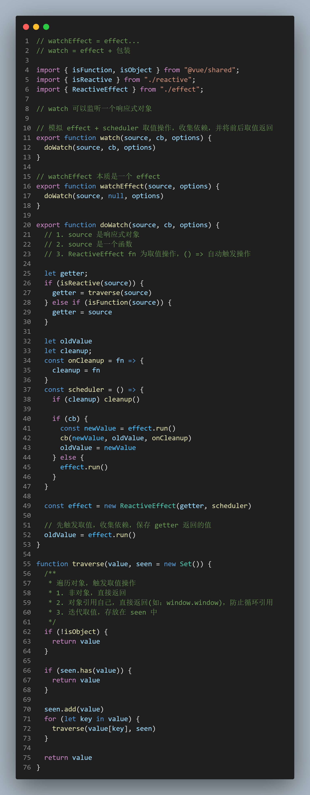

## watch Method

### watch
`Vue` 框架，分包管理。`watch` 的大致关系为 `vue` -> `runtime-dom` -> `reactivity`

watch 内部就是 new 一个 `ReactiveEffect`，传入 fn 和 `scheduler`，fn 包装成 getter，触发取值操作，数据变化时，自行执行 `scheduler`

### watchEffect
watchEffect 本质就是一个 effect，默认是异步执行；
watch 是监控一个数据的变化，数据更新执行 effect，传入的 cb，启用了 ReactiveEffect(fn, scheduler) 中的 scheduler 调度执行的函数

```js
// effect + scheduler 取值操作，收集依赖，并将前后取值返回
export function watch(source, cb, options) {
  doWatch(source, cb, options)
}

// watchEffect 本质是一个 effect
export function watchEffect(source, options) {
  doWatch(source, null, options)
}

/** 
* 不同点：
* 1. 参数一：watch 两种传参方式（对象 or 函数返回值取值），即 getter
* 2. 参数二：watch 数据更新的回调函数。watchEffect 是 options，没有

* 相同点：
* 1. 默认都是异步执行操作
* 2. 参数三，可传入 flush 参数，取消异步执行时机
*/
export function doWatch(source, cb, options) {
  // 1. source 是响应式对象
  // 2. source 是一个函数
  // 3. ReactiveEffect fn 为取值操作，() => 自动触发操作

  let getter;
  if (isReactive(source)) {
    getter = traverse(source)
  } else if (isFunction(source)) {
    // watchEffect 传入的就是包含取值操作的函数，new ReactiveEffect 时取值收集依赖
    getter = source
  }

  let oldValue

  const scheduler = () => {
    if (cb) {
      // watch 函数，第二个参数
      const newValue = effect.run()
      cb(newValue, oldValue)
      oldValue = newValue
    } else {
      // watchEffect 则是直接帮忙执行 source 方法，等同于 effect 方法
      effect.run()
    }
  }

  // watch 和 watchEffect 复用 new ReactiveEffect，传入 scheduler
  // scheduler 根据是否传入 cb，
  const effect = new ReactiveEffect(getter, scheduler)

  // 先触发取值，收集依赖，保存 getter 返回的值
  oldValue = effect.run()
}
```

### watch cleanup


背景
**场景**：用户输入框中，输入信息查询，后端数据返回时间问题，会导致返回数据渲染问题。
**方案**：
  1. 取消请求
  2. 清理定时器
  3. 屏蔽数据（类似防抖操作，最新请求发出时，丢弃上次请求返回值）
**代码解决**
  1. vue2 中需要自行解决
  2. vue3 提供 onCleanup 回调函数
  ```js
  // mock backend response
    let time = 3000
    function getData(input) {
      return new Promise(resolve => {
        setTimeout(() => resolve(input), time -= 1000)
      })
    }

    const state = reactive({ name: 'Stella', age: 18 })

    let arr = []
    watch(() => state.age, async function callback (newVal, oldVal, onCleanup) {
      // 屏蔽返回的数据，不进行更新

      // vue2 处理方式
      // 闭包：函数的创建和执行不在一个作用域。
      // debugger 
      // 通过代码调试：
      // 每次更新age值，都会触发 callback 执行，getData 返回的数据需要等待时间
      // 类似防抖操作，下一次请求操作发出时，丢弃上次的返回值

      while(arr.length > 0) {
        let fn = arr.shift()
        fn()
      }

      let flag = true
      arr.push(() => flag = false )
      // vue3 提供 onCleanup
      // let flag = true
      // onCleanup(() => flag = false)

      const res = await getData(newVal)
      flag && (app.innerHTML = res)
    })

    // 不用 setTimeout 默认批量更新
    const timer1 = setTimeout(() => state.age = 19) // 3s后返回
    const timer2 = setTimeout(() => state.age = 20) // 2s后返回
    const timer3 = setTimeout(() => state.age = 21) // 1s后返回 newVal
  ```

vue3 实现
```js
// apiWatch.ts

let cleanup;
const onCleanup = fn => {
  cleanup = fn
}
const scheduler = () => {
  if (cleanup) cleanup()

  if (cb) {
    const newValue = effect.run()
    cb(newValue, oldValue, onCleanup)
    oldValue = newValue
  } else {
    effect.run()
  }
}
```


### 手写
