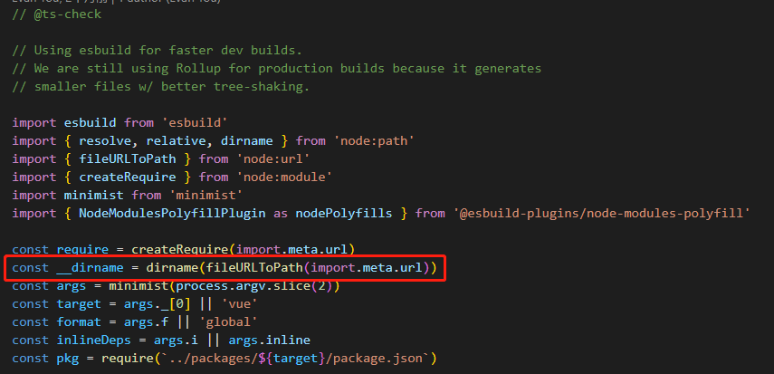

## 位运算符 
[reference](https://www.runoob.com/w3cnote/bit-operation.html)
| 符号 | 描述 | 运算规则 |
| ---- | ---- | --- |
| &	| 与 |	两个位都为1时，结果才为1 |
| \|| 或 |	两个位都为0时，结果才为0 |
| ^	| 异或 |	两个位相同为0，相异为1 |
| ~	| 取反 |	0变1，1变0 |
| <<| 左移 |	各二进位全部左移若干位，高位丢弃，低位补0 |
| >>| 右移 |	各二进位全部右移若干位，对无符号数，高位补0，有符号数，各编译器处理方法不一样，有的补符号位（算术右移），有的补0（逻辑右移） |

## Error Records

1. `dev` 环境下的打包，基于 `esbuild` 快捷高效，便于 `tree-shaking`。打包时，dev.js 文件，引入包名时有两种方式`import or require`。如果使用 `node require` 方式，打包编译时会报如下错误：
 
解决：根据提示可知，package.json 中添加 `type: "module"` 即可。

2. 上述步骤，再次运行，新问题出现：
 
解决： `__dirname` 属于 `node` 变量，在 `module` 中存在。根据源码，可引用 `dirname` 方法。
 
