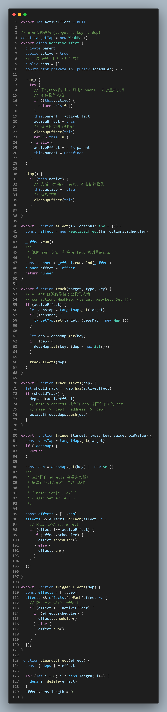
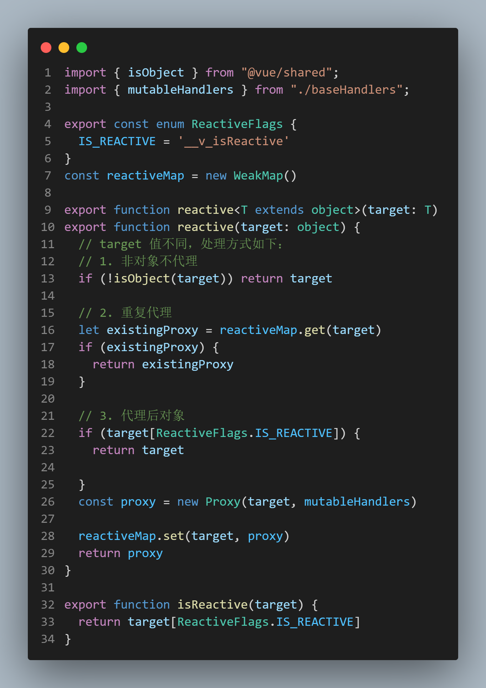
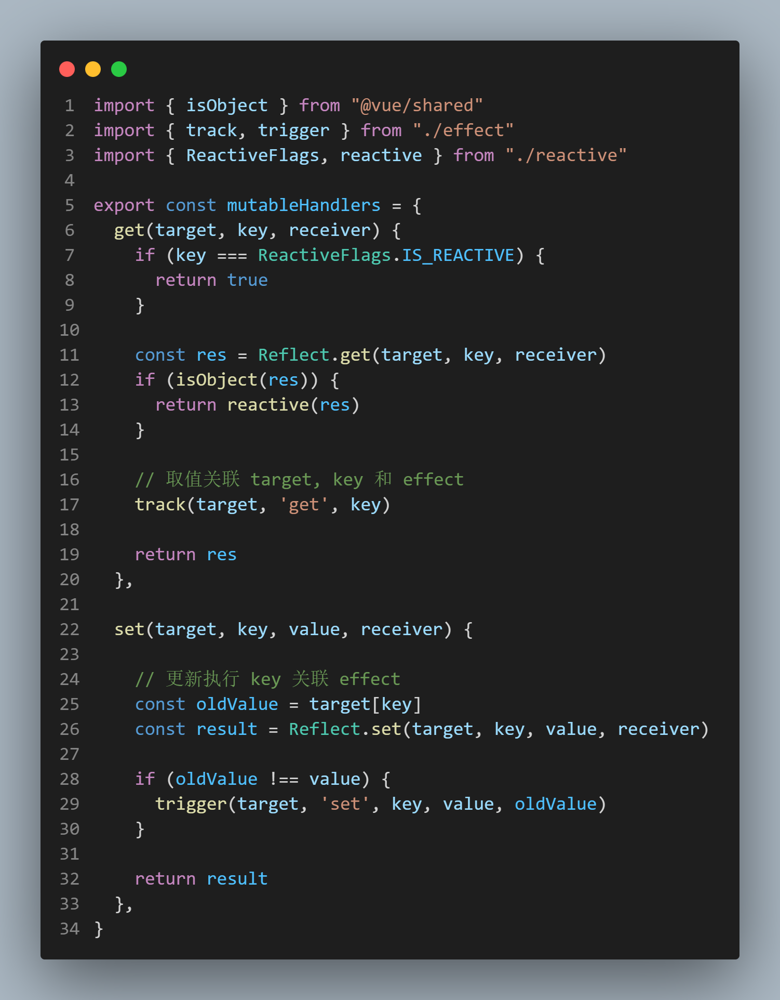

## Reactive Package

### 数据代理
`vue3` 是基于 `Proxy` 实现，而 `vue2` 是基于 `Object.defineProperty``。注意，Proxy` 搭配 `Reflect` 实现，用以解决 `this` 调用时指向问题。

```js
cconst school = {
  students: 100,
  teachers: 200,
  get total() {
    return this.students + this.teachers
  }
}

const p = new Proxy(school, {
  get(target, key, receiver) {
    console.log(`Get ${key} ----`)
    // return target[key]

    // 绑定 school.total 取值(this.students + this.teachers)时内部的 this 会绑定为代理后的 p 对象 
    return Reflect.get(target, key, receiver)
  },
  set(target, key, value, receiver) {
    console.log(`Set ${key} ----`)
    return target[key] = value
  }
})

console.log(p.total)

/**
 * Proxy 不用 Reflect 时，则只会触发 total 在代理取值时的操作，this指向的是 school
 * Get total ----
 * 300
 * 
 * 使用 Reflect 时，this 则指向代理对象 p
 * Get total ----
 * Get students ----
 * Get teachers ----
 * 300
 */
```

### 特殊数据代理处理

分三种情况：非对象，重复代理，被代理过的对象

```js
  // target 值不同，处理方式如下：
  // 1. 非对象不代理
  if (!isObject(target)) return target

  // 2. 重复代理
  let existingProxy = reactiveMap.get(target)
  if (existingProxy) {
    return existingProxy
  }

  // 3. 代理后对象
  // 只有被代理的对象
  if (target[ReactiveFlags.IS_REACTIVE]) {
    return target
  }
```

### effect 函数执行

1. 如何关联正在执行的 effect 和响应式数据的取值
  - `effect.ts` 暴露出变量 `activeEffect`
  - `get` 取值操作时，通过变量 `activeEffect` 就建立起连接 `{target -> key -> dep}`
  - **每执行完一个 effect(fn)，就要清空当前的 activeEffect；而执行前，把 reactiveEffect 实例复制给 activeEffect**，这样才能保证fn执行时，内部用到的响应式数据，可以建立连接
  

2. 每调用一次 effect，就会重新 new 一个 `ReactiveEffect`
  - 嵌套 effect 需要考虑在内。
  
  - 解决方案 2.x 基于栈来处理（进出栈），需要额外维护。
  - vue3 则运用树结构，标记关系即可。
  

### 依赖收集
默认执行 effect 时会对属性，进行依赖收集

- effect 函数内取值，才会 
- `activeEffect.deps` 将属性和对应的 `effect` 维护成映射关系，后续属性变化可以触发对应的 `effect` 函数重新 `run`


### 触发更新
取值时已收集过依赖，更新操作即触发 effect 重新执行


### 清除 effect 产生的副作用

flag 动态收集依赖（如下），就需要清除依赖
```js
import { reactive, effect } from './index.js'
    
const state = reactive({ flag: true, name: 'Stella', age: 18, address: 'Wuhan' })
effect(() => {
  console.log('effect exec')

  // 1. flag 为true，取值逻辑只有 name 没有 age，effect 只与 name 建立 connection
  app.innerHTML =  state.flag
    ? 'Name: ' + state.name
    : 'Age: ' + state.age
})

setTimeout(() => {
  // 此处 flag 设置为 false，触发 effect，取值只会取 age，前面 name 取值收集的依赖应该清除
  state.flag = false
  
  setTimeout(() => {
    // 修改 name，不应触发 effect 函数执行
    state.name ='Yang'
  }, 1000)
}, 1000)

```

更新操作时，会触发收集的 effect 执行，执行前应将此前收集的（取消绑定的）effect 清除掉
```js
class ReactiveEffect {
  private parent
  active = true
  // 记录 effect 中使用的属性
  deps = []
  constructor(private fn) { }

  run() {
    try {
      this.parent = activeEffect
      activeEffect = this
      // 清理收集的 effect +
      cleanupEffect(this)
      this.fn()
    } finally {
      activeEffect = this.parent
      this.parent = undefined
    }
  }

  stop() { }
}

function cleanupEffect(effect) {
  const { deps } = effect

  for (let i = 0; i < deps.length; i++) {
    deps[i].delete(effect)
  }
  effect.deps.length = 0
}

export function trigger(target, type, key, value, oldValue) {
  const depsMap = targetMap.get(target)
  if (!depsMap) {
    return
  }

  const deps = depsMap.get(key) || new Set()
  /** +++++++
   * 直接操作 effects 会导致死循环
   * 解决：应改为副本，再迭代操作
   * 
   * { name: Set[e1, e2] }
   * { age: Set[e2, e3] }
   */

  const effects = [...deps]
  effects && effects.forEach(effect => {
    if (effect !== activeEffect) {
      effect.run()
    }
  });

}
```

### Stop Effect
默认响应式数据，是自动更新的。而某些场景，是需要用户手动更新 effect，即 forceUpdate

1. `effect` 调用后，会返回一个对象 `runner` ，挂在了 `effect` 实例对象
2. `runner` 就是 `run` 方法
3. 调用 `stop` 后，再次修改 `state` 不会触发更新
4. 停止 effect 之后，需要清理收集的依赖，并将 ReactiveEffet.active 变为失活状态
5. 调用 runner 方法，判断 active 是否失活，不走依赖收集，直接调用 fn

用法
```js
    const state = reactive({  name: 'Stella' })
    
    const runner = effect(() => {
      app.innerHTML = state.name
    })

    runner()
    
    // 清理依赖
    runner.effect.stop()

    // 失活后，任然可以调用，手动更新
    state.name = 'yang'
    runner() 

```

### 调度执行 scheduler
`effect` 方法，内部传入 `scheduler` 方法，可以在数据变化时，自行操作 `run`
`trigger` 触发时，我们可以自己决定副作用函数执行的时机、次数、及执行方式

```js
// effect.ts function trigger() {}
 effects && effects.forEach(effect => {
    // 防止再次执行的 effect
    if (effect !== activeEffect) {
      // 执行用户传入 scheduler
      if (effect.scheduler) {
        effect.scheduler()
      } else {
        effect.run()
      }
    }
  });
```

### 深度代理

state 属性对应的对象，也需要深度代理
```js
// baseHandlers.ts function mutableHandlers() {}
  get(target, key, receiver) {
    if (key === ReactiveFlags.IS_REACTIVE) {
      return true
    }

    // 深度代理
    const res = Reflect.get(target, key, receiver)
    if (isObject(res)) {
      return reactive(res)
    }

    // 取值关联 target, key 和 effect
    track(target, 'get', key)

    return res
  },
```

### 代码实现

effect.ts


reactive.ts


baseHandlers.ts
